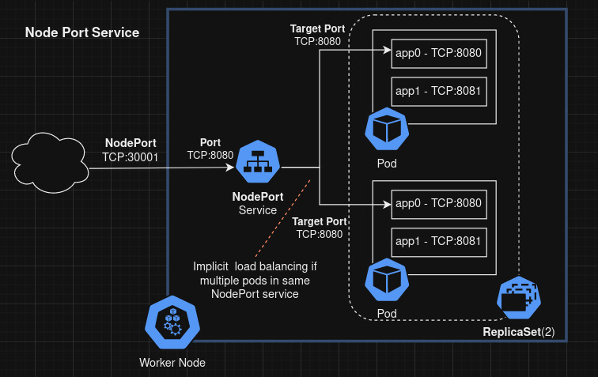

# Kubernetes / K8s

## Operations
ℹ️  There's also an official K8S cheatsheet [here!](https://kubernetes.io/docs/reference/kubectl/cheatsheet/)

#### Set Default Namespace
```bash
kubectl config set-context --current --namespace=my-namespace
```
#### Get pods with label
```bash
kubectl get pods -l KEY=VALUE
```

#### Run command/shell on pod
`-it` is needed if interactive shell is required<br>
`-c <CONTAINER_NAME>` to specify a container in multi-container pod
```bash
kubectl exec -it POD_NAME -- /bin/bash

# Target specific container in multi-container pod with '-c'
kubectl exec -it -c CONTAINER_NAME POD_NAME -- /bin/bash
```

#### Get Logs of container
```bash
kubectl logs POD_NAME

# Target specific container in multi-container pod with '-c'
kubectl logs -c CONTAINER_NAME POD_NAME
```

#### List all containers
In a specific pod...
```bash
kubectl get pods POD_NAME -o json | jq '.spec.containers[] | 
    {name, image} | join (", ")'
```
In all pods with a label...
```bash
kubectl get pods -l KEY=VALUE -o json | jq '.items[] | 
    .metadata.name as $POD_NAME | 
    .spec.containers[] | {"pod":$POD_NAME, name, image}'
```

#### Refresh Pods/Deployment
```bash
kubectl rollout restart deployment/my-app
```

## Architecture
### Services
#### NodePort 
Exposes the service on each Node's IP at a static port ("NodePort")


## Build
### Patterns
See [Kubernetes Patterns](../patterns/k8s.md)

### Dry Run
Helpful to generate K8S YAML config files of ConfigMaps of raw file data as the YAML config for ConfigMap does not support file/path references.

This example creates a ConfigMap YAML config file by referencing the content of an actual file (`config.ini`) from the local system. 
```bash
cat config.ini
[defualt]
config0 a
config1 b
```
```bash
kubectl create cm --dry-run=client test-cm --from-file=config.ini --output yaml
```
```ini
apiVersion: v1
data:
  config.ini: |
    [defualt]
    config0 a
    config1 b
kind: ConfigMap
metadata:
  creationTimestamp: null
  name: test-cm

```
