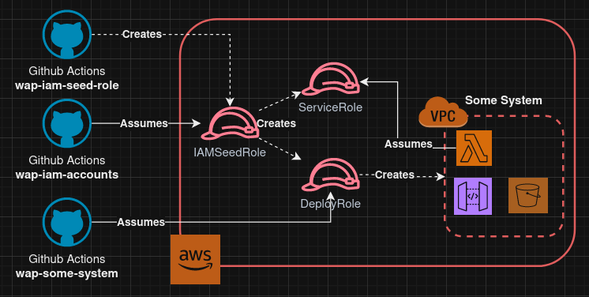

# IAM and Accounts for WAP
Identity and Access Management, and Account access for the wmax641 app platform (WAP)

## Architecture and Design

## Operation

#### Deploy Role
This role should be used by Github Actions to create and deploy AWS resources.

Is meant to be assumed by Github Action's web identity conditional that it comes from a particular repository and environment. This role should be given permissions to create and modify AWS resources.

#### Service Role
Is any sort of IAM role that may be used by a particular system (as opposed to being assumed by Github Actions)

### Create Roles

Follow the example in [wmax641/wap-iam-accounts](https://github.com/wmax641/wap-iam-accounts)/role_dummy.tf.example.

For deploy role, need to set `create_deploy_role = true`

Very important to set the correct `used_by_repo` variable, as the Deploy Role is dependent on this value for its conditional access.

## Development
### Initial Setup and Seed Role
See [Terraform Bootstrap](./tf_bootstrap.md)
